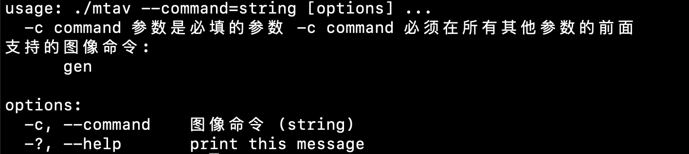

# MTAV 安装

MTAV使用C++语言编写，依赖opencv(opencv2以上均可)，目前支持从源码编译安装。

## opencv安装
Debian和Ubuntu系统可直接通过 `apt-get install libopencv-dev` 安装
MacOs 可通过brew 安装 

目前MTAV通过 Makefile 管理编译过程，Makefile命令依赖pkg-config管理OpenCV头文件和库文件位置

```
CFLAGS+=`pkg-config --cflags opencv`
LDFLAGS+=`pkg-config --libs opencv`
```

如果机器上opencv不是通过pkg-config管理，或者是自行编译的opencv库，请替换上述 `CFLAGS` 和 `LDFLAGS`即可，类似：

```
CFLAGS+=-I/自定义路径/opencv/x.x.x/include/opencv4
LDFLAGS+=`-L//自定义路径/opencv/x.x.x/lib -lopencv_imgproc -lopencv_core -lopencv_imgcodecs -lopencv_videoio -lopencv_highgui`
```

MTAV依赖opencv的 core,imgproc,imgcodecs,videoio,highgui 等模块

更多信息请参考 [OpenCV官网][https://opencv.org]

## 编译
进入MTAV目录，执行 `make` 命令开始编译，成功后会在当前目录生成 mtav 可执行文件

## 运行
将生成的 mtav 放入系统路径，或者执行 `./mtav` 将会看到类似如下图输出：


