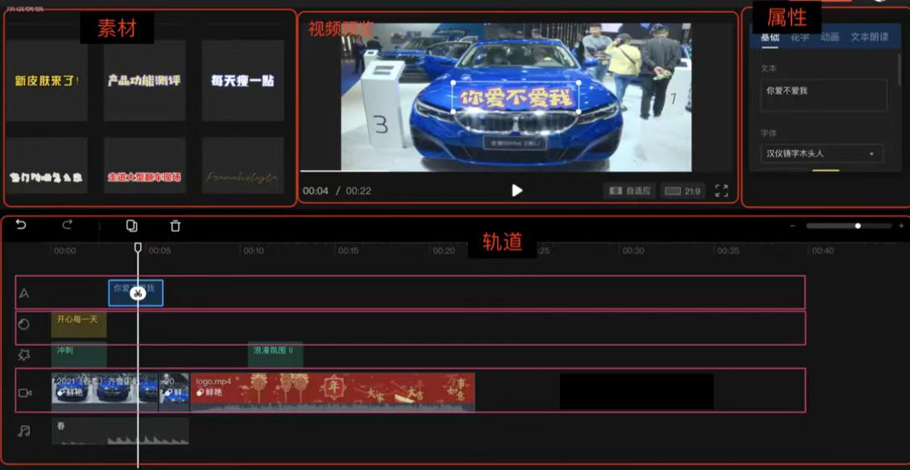

# 轨道配置

轨道列表是MTAV配置文件中的核心部分，如下图，轨道列表类似渲染轨道的集合，每个轨道都有在视频中出现的时间范围，以及在视频中的位置、透明度、旋转角度等基础渲染属性，不同类型的轨道确定了通过渲染属性形成视觉元素的规则。



轨道主要由基本属性，素材，渲染属性以及动画四部分组成；

```
{   
    ...
    "trackers":[{
            "trackType":"simpleImage",
            "startFrame":0,
            "endFrame":120,
            "input":{
                "image":"/data/6548-dst-50.jpg"
            },
            "initProperties":{
                "videoAlignPtX":0.5,
                "videoAlignPtY":0.5,
                "trackerAlignPtX":0.5,
                "trackerAlignPtY":0.5,
                "alpha":1,
                "scale":1,
                "rotate":0
            },
            "animation":[
                {
                    "property": "rotate",
                    "startVal": 0,
                    "endVal": 3600,
                    "startOffsetFrame":0,
                    "endOffsetFrame":120,
                    "interpolator":{
                        "interType":"linear"
                    }
                }
            ]
        }
    ]
}
```

## 轨道基础属性

### trackType
轨道类型， 不同的轨道类型确定了通过素材和渲染属性形成最终的视觉效果的逻辑

### startFrame
轨道开始渲染帧索引； 从0开始，0代表在输出视频中从一开始就渲染。

### endFrame
轨道结束渲染帧索引。

从开始帧(包括开始帧)会出现该轨道的内容，一直到结束帧(包括结束帧)。

## 素材(input)
轨道渲染内容依赖的外部素材文件路径，不同轨道类型依赖的素材不同。具体可参考各个轨道详细文档

## 渲染属性(initProperties)
渲染属性是一系列的属性值，配合素材(input) 一起决定了渲染内容的最终表现，所有轨道都有一些基础的渲染属性例如位置(通过对齐点表达)，透明度(alpha)，缩放(scale)，旋转(rotate)
除了基础渲染属性外，不同的轨道还有一些各自独有的渲染属性，例如简单视频轨道(simpleVideo)的帧索引，具体可参照各个轨道的渲染属性文档

### 对齐点
对齐点通过描述视频坐标系中点和轨道图像坐标系上点的重合关系来表达轨道图像内容的位置。
视频坐标系中的点： VideoPoint(videoAlignPtX,videoAlignPtY)
轨道图像坐标系中的点： TrackerPoint(trackerAlignPtX,trackerAlignPtY)

视频坐标系原点在输出视频的左上方，向下为Y轴正方向，向右为X轴正方向
轨道图像坐标系在轨道图像的左上方，坐标轴方向同视频坐标系

视频坐标系和轨道图像坐标系中 videoAlignPtX,videoAlignPtY,trackerAlignPtX,trackerAlignPtY取值范围都是[0,1];
即视频坐标系和轨道图像坐标系都是归一化的相对坐标系，单位长度为内容尺寸；

videoAlignPtX=1 代表在输出视频的最右侧
videoAlignPtY=1 代表在输出视频的最下方

trackerAlignPtX=1 代表在轨道图像内容的最右侧
trackerAlignPtY=1 代表在轨道图像内容的最下方

为什么要用对齐点来描述轨道的位置？因为轨道图像随着视频时间会进行旋转缩放等动态过程，这时候轨道内容位置的需要一种灵活且表达能力更强的定义方式。

举例，定义轨道图像中心在视频中央进行旋转缩放，那么只需要指定:

VideoPoint(videoAlignPtX,videoAlignPtY) = (0.5,0.5)
TrackerPoint(trackerAlignPtX,trackerAlignPtY) = (0.5,0.5) 

而无需关心轨道缩放前后，旋转前后的尺寸等状态变化


### alpha
轨道图像的透明度, 取值范围[0,1];

alpha=1 说明轨道图像内容完全不透明
alpha=0 说明轨道图像内容完全透明，内容不可见

### scale
轨道图像内容缩放比例， (0,unlimited)
scale=1 无需缩放，保持内容本来的尺寸
scale < 1 缩小； scale > 1 放大

### rotate
旋转角度，单位是角度；rotate描述的旋转是绕轨道图像的中心点进行的旋转

顺时针方向旋转为正方向


## 动画(animation)
MTAV中的动画都是指的属性动画，描述的是随着视频时间轴的推进，轨道属性随着时间推进如何进行变化
一个轨道可以定义多个动画，因此轨道的动画(animation)是一个动画数组

如下面的这个动画描述的是 rotate属性(property)，在轨道的初始帧之后0帧(startOffsetFrame)的时候开始进行变化，一直持续到初始帧之后120帧(endOffsetFrame)，这期间属性值从起始值(startVal)0以线性插值(interpolator)的方式变化到结束值(endVal)120

```
{
    "property": "rotate",
    "startVal": 0,
    "endVal": 3600,
    "startOffsetFrame":0,
    "endOffsetFrame":120,
    "interpolator":{
        "interType":"linear"
    }
}
```

### property
每一个动画都是针对具体的某个渲染属性，property就指定了动画作用的具体属性名称

### startOffsetFrame/endOffsetFrame
startOffsetFrame/endOffsetFrame  起始帧/结束帧表示动画开始发生到结束的时间范围，它是相对于所在轨道的开始帧的偏移值。

例如轨道startFrame=100, 其中某个动画startOffsetFrame=200, endOffsetFrame=300;
说明该轨道在视频第100帧开始渲染，并且在视频第300(100+200)帧的时候开始该动画， 该动画在视频第400(100+300)帧时结束

### startVal/endVal
startVal/endVal 表示动画的渲染属性在动画开始时/结束时的值。
即动画指定的渲染属性的值将在动画期间从起始值变化到结束值。

### interpolator
插值器(interpolator) 描述的是渲染属性从起始值变化到结束值的变化过程，即渲染属性的取值跟随时间变化过程中，渲染属性的取值如何从起始值变化到结束值

#### interType
插值器类型， 不同插值器代表属性的不同变化过程，具体可参考 [插值器](interpolator.md)。
部分插值器带参数，可以通过参数控制插值变化过程。

